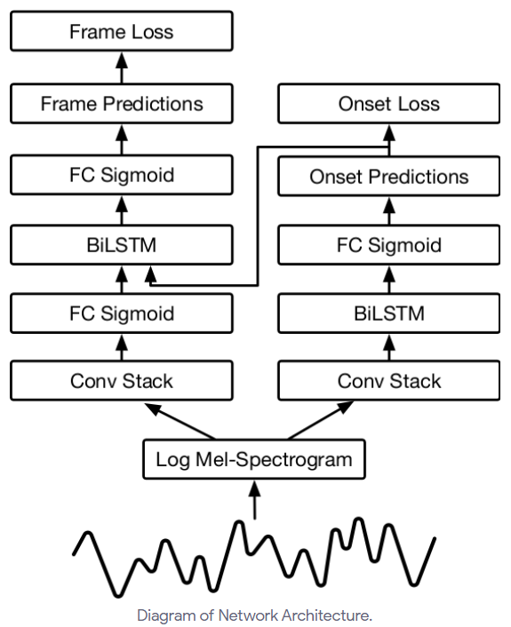

# HW3 : Automatic Polyphonic Piano Transcription

Automatic music transcription (AMT) refers to an automated process that converts musical signals into a piano roll. Polyphonic piano transcription is a specific AMT task for piano music.  
Because of sequential aspect of piano transcription, recurrent neural network(RNN) module is commonly used for the task.
**Since it tooks quite long time to converge, we will not evaluate the performance or the model.**
For Q1~Q3, you can report the results at 5k training steps.
In this homework, your task is re-implement two RNN-based transcription models. The goals of the homeworks are as follows:

* Experiencing the deep learning process with sequential data.
* Getting familiar with RNN architectures.

## Dataset [[download link]](https://drive.google.com/file/d/185czlGZGXdDu8lFCnpe5nLpyZtKuao_p/view?usp=sharing)
We will use subset of [MAESTRO](https://magenta.tensorflow.org/datasets/maestro) dataset for this homework. The dataset contains performances of classical pieces, played by junior pianists. The audiofile and corresponding midi files are given. The midi files are recorded through special piano that can capture note timings and speeds.
We will convert the midi files into pianoroll format, and we will train our network to estimate that pianoroll from the audio, in supervised way.
We arbitary selected 100 / 20 / 50 (train/valid/test) performances from original dataset for this homework.

Once you downloaded the dataset, unzip and move the dataset to the homework folder. *'data'* folder is expected to be located inside the *'hw3'* folder.

```
$ pwd
{YOUR_DIRECTORY}/gct-2020/hw3
$ unzip maestro_small.zip
...
$ ls data
2004  2006  2008  2009  2011  2013  2014  2015  2017  2018  data.json
```

We provide dataloader to process the dataset (*dataset.py*). It will segment the audio and midis into specified length (when *sequence_length* is given), or precess whole audio (when *sequence_length = None*), and convert the midi into pianoroll format (frame roll and onset roll). Details are given in the notebook (notebooks/dataset.ipynb).

## Training simple CNN based model
Complete baseline codes are given (CNN architecture is based on work by [Kelz et al.](https://arxiv.org/pdf/1612.05153.pdf)). In the Baseline model, each onset and frame is seperately processed by a CNN model (*model.Transcriber*). You can run the whole process by running *train.py* (you might see some warning, but it's fine). It requires ~4.8GB GRAM and ~1.5GB RAM. If it exceed the limit of your envionment, try smaller *batch_size* or *sequence_length*. Checkout the options in *train.py*.
```
$ python train.py
Loading 1 group of MAESTRO_small at data
Loading group train: 100%|█████████████████████████████████████| 100/100 [00:25<00:00,  3.97it/s]
Loading 1 group of MAESTRO_small at data
Loading group validation: 100%|████████████████████████████████████████| 20/20 [00:04<00:00,  4.08it/s]
10%|████████████████▌                                  | 999/10000 [02:20<23:03,  6.51it/s, loss: 1.381e-01]
metric/loss/frame_loss      : 0.0873
metric/loss/onset_loss      : 0.0416
metric/frame/frame_f1       : 0.3632
metric/frame/onset_f1       : 0.0000
metric/note/f1              : 0.0000
metric/note-with-offsets/f1 : 0.0000
...
```

If it takes too long, or something goes wrong, try debug mode, which uses smaller number of data, and shorter iterations (not appropriate for training). I suggest you to try debug mode first when you run a new model.
```
$ python train.py --debug
Loading 1 group of MAESTRO_small at data
Loading group debug: 100%|███████████████████████████████████████████████████████████| 10/10 [00:03<00:00,  3.02it/s]
  8%|█████████████                                                                 | 8/100 [00:00<00:08, 11.09it/s, loss: 4.227e-01]
metric/loss/frame_loss      : 0.3231
metric/loss/onset_loss      : 0.2134
metric/frame/frame_f1       : 0.0850
metric/frame/onset_f1       : 0.0000
metric/note/f1              : 0.0000
metric/note-with-offsets/f1 : 0.0000
```

## Metrics
The prediction of the network will be evaluated in two ways.
frame-wise metric *metric/frame* check the prediction is correct or not, by frame by frame.
When we calculate note-wise metric *metirc/note*, we first decode the predictions into notes (*evaluate.extract_notes*) with simple logic. When a new onset or frame appears, we add a new note. The offset of the note is determined when frame is not detected. The prediction is assumed correct when the onset error is within +-50ms. The offset is assumed correct when offset error is within +-50ms or 20% of note duration. we used [mir_eval](https://craffel.github.io/mir_eval/) for evaluation.

If you are not familiar with precision / recall / F-score, checkout the [wiki](https://en.wikipedia.org/wiki/F-score). But you can focus on F1 score since it's quite a faithful metric.

## Question 1: implement LSTM based model.
Go to *model.py*, and implement model only consists with lstm layers. Use same specification for  both networks same as baseline. 
| Layer     | Spec                                                    | Output size   |
|-----------|---------------------------------------------------------|---------------|
| LogMel    | model.LogMelSpectrogram                                 | Time x 229    |
| LSTM      | 2 layer Bi-directional LSTM. 88 unit for each direction.| Time x 88\*2   |
| Output fc | 88 unit, linear                                         | Time x 88     |


## Question 2: implement CNN-RNN(CRNN) model
| Layer     | Spec                                                    | Output size   |
|-----------|---------------------------------------------------------|---------------|
| LogMel    | model.LogMelSpectrogram                                 | Time x 229    |
| ConvStack | model.ConvStack                                         | Time x fc_unit|
| LSTM      | 2 layer Bi-directional LSTM. 88 unit for each direction.| Time x 88\*2   |
| Output fc | 88 unit, linear                                         | Time x 88     |

## Question 3: implement Onsets-and-Frames model, which have interconnection between onsets and frames.
In the work of [Hawrhorne et al.](https://arxiv.org/abs/1710.11153), they made interconnection between onsets and frames; onset prediction is feeded into LSTM layer of frame, as well as CNN output. For inter connection (onset_predictions->frame_BiLSTM), stop the gradient. You can use same specification for CNN and LSTM layer in HW2.




## Question 4: Discuss and analyze the results of the models. What kinds of error did you observe? How could you improve the results? (You don't have to implement it) 

## Deliverables
You should submit your Python code (.ipynb or .py files) and homework report (.pdf file) to KLMS. The report should include:

<<<<<<< HEAD
* Experiments and Results
* Discussion
=======
Experiments and Results
Discussion
>>>>>>> 53bc30187bdabcd91396850c9fd4519b6480ad7e

## Transcribe your own!
We will provide the code that can transcribe your own audiofile, with your trained model.


## Credit
Many lines of codes are borrowed from [Onsets-and-Frames implementation](https://github.com/jongwook/onsets-and-frames) of Jongwook Kim. Implemented by [Taegyun Kwon](https://taegyunkwon.github.io/) @ [MAClab](https://mac.kaist.ac.kr/)
