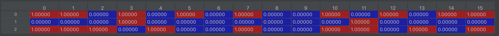

# Homework #4(Practice): Drum pattern generation [Colab Notebook](https://colab.research.google.com/drive/1dveHNwb9RzvSLzDbpytmpoFmBkM459sr?usp=sharing)
Among the many elements of music, rhythm is the element that best represents the characteristics of each genre of music.
In this practice, we will use the Conditional Variational Auto-encoder to generate drum patterns using genre conditions. Specifically, the goals of this homework are as follows:

* Experience CVAE architecture
* Experience MIDI data processing

## Dataset
In this practice, we use the dataset we collected. The data size is 3 X 16 Matrix, where 3 represents Kick, Snare, and HH, and 16 represents 16th notes. If there is a drum in the beat, it is indicated as 1, and if not, it is indicated as 0. Also, to make the problem as simple as possible, we removed all the velocities.

A total of 6016 drum patterns are used, and the number of data sets by genre is as follows.   
'Rock', 1443 ,  'Metal', 1102 ,  'Funk', 963 ,  'Jazz', 603 ,  'Latin', 539 ,  'Pop', 537 ,   'Hip Hop', 324 ,  'Blues', 197 ,  'Military', 179 ,  'Country', 162 

Sampling example may not be good because the amount of dataset is not large enough. To increase the size of the data set, you can refer to the drum data set provided by the Google Magenta Project.

[Magenta Groovae](https://magenta.tensorflow.org/datasets/groove)

## Basic code
The source code of the basic algorithm is provided. The base model uses an encoder and decoder based on MLP.

* def train : Training function, png files for comparing the original matrix and the reconstruction matrix is saved.
* def test : Test function, png files for comparing the original matrix and the reconstruction matrix is saved.
* def midi_saving : A function that converts the inferred matrix into a MIDI file. The inferred matrix is predicted by probability values, so if the probability value exceeds the threshold, it is assumed that notes are present. Default threshold = 0.3
* Run and Sampling : Runs the defined train and test functions, and samples drum patterns by genre

## Sampling MIDI
You'll need a DAW and a drum vsti to listen to the MIDI examples. If you don't have any DAW or Drum VSTI, you can download the free DAW reaper) and VSTi  Power drum kit) from the link below.

http://reaper.fm/download.php
https://www.powerdrumkit.com/download76187.php

## Deliverables
Since this is a practice project, you do not need to submit any results.

